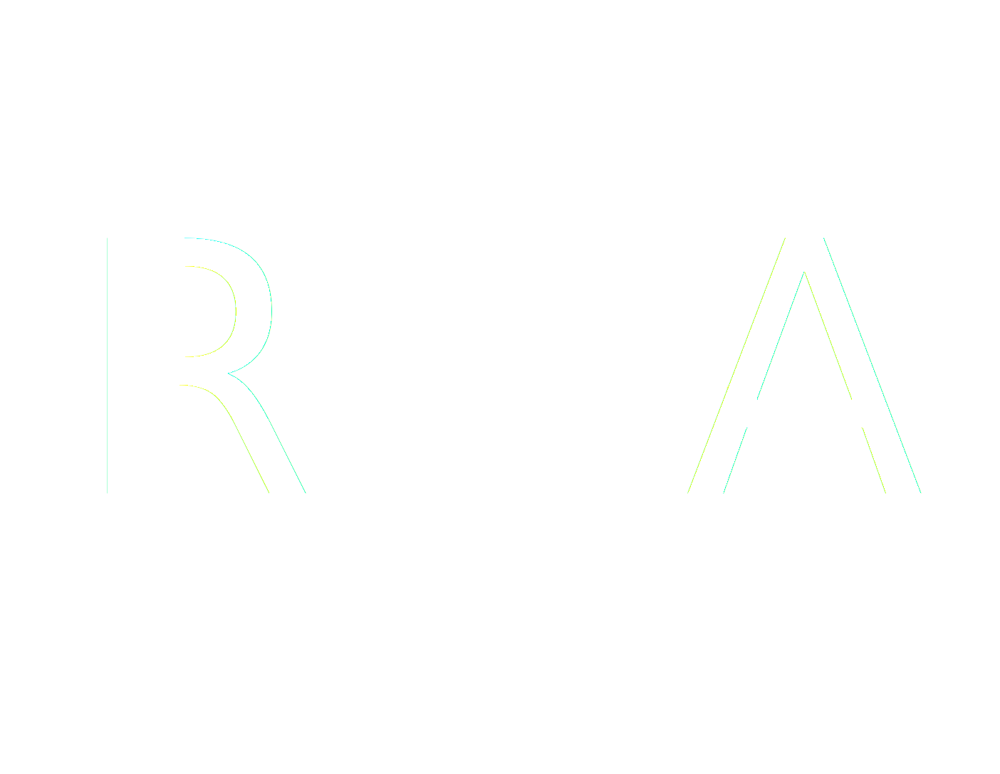

  <a href="https://ridwanazeez.github.io/">
    
    <h2 align="center">Ridwan Azeez</h2>
  </a>

 

This repo stores the code for my personal portfolio website.

    
    

## 🛠 Built With
⚡ [VueJS v3](https://vuejs.org/) \
⚡ [TailwindCSS](https://tailwindcss.com/) \
⚡ [Heroicons (included with Vue)](https://heroicons.com/) \
⚡ [VueUse](https://vueuse.org/)

---
Made with ♥ from Georgetown, Guyana ✈